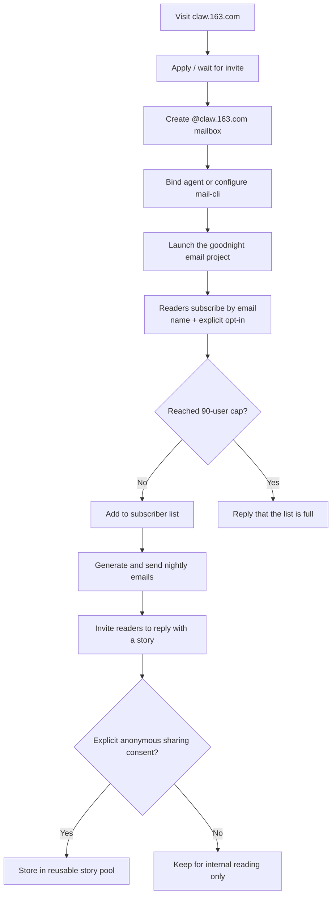

# claw-goodnight-email

[中文](./README.md)

A Codex / OpenClaw skill for running a small, human-feeling goodnight email project with ClawEmail or any mailbox-driven workflow.

It helps you:

- collect subscriptions by email
- enforce a fixed capacity cap
- handle unsubscribe requests
- collect story submissions with explicit anonymous-sharing consent
- compose nightly goodnight emails
- send the nightly batch through `mail-cli`

## What This Is

This repository packages a lightweight operating model for a “write to me every night” email product.

The default flow is:

- subscribers email your project mailbox with their name and a clear opt-in
- the system stores subscriber state in `data/state.json`
- each night it composes one email per active subscriber
- each email can invite readers to reply with a short story or reflection
- story content is only reusable if the sender explicitly grants anonymous sharing permission

The tone is meant to feel warm, restrained, and human rather than like a newsletter or support bot.

## How To Apply For A ClawEmail Mailbox

Official site:

- [claw.163.com](https://claw.163.com)

In many cases, ClawEmail still works like an early-access product, so the common path is:

1. visit the official site and submit your application
2. wait for an invite code or approval
3. create your `@claw.163.com` mailbox
4. follow the official guide to bind your agent or configure your CLI flow
5. replace the placeholder mailbox in this repo with your real project address

If you are completely new to the product, create the mailbox first and then wire this skill into your workflow.

## Flow Diagram

This diagram shows the full loop from mailbox application to nightly sending and story collection:



Excalidraw source:

- `assets/claw-goodnight-email-flow.excalidraw`

## Repository Layout

```text
claw-goodnight-email/
├── README.md
├── README.en.md
├── SKILL.md
├── agents/openai.yaml
├── data/state.json
├── references/
├── scripts/goodnight_manager.py
├── scripts/send_nightly_batch.py
└── scripts/run_nightly_sender.sh
```

## Sanitization

This open-source version is sanitized:

- no real subscriber emails
- no real names
- no real send logs
- no machine-specific absolute paths
- no private tokens or credentials

If you use this in production, keep runtime data and logs out of version control.

## Requirements

- Python 3.10+
- `mail-cli` available on `PATH` for real sending
- a mailbox profile already configured in `mail-cli`

For local testing, you can safely use `--dry-run` without sending real email.

## Quick Start

From the project root:

```bash
python3 scripts/goodnight_manager.py --help
```

Subscribe one user manually:

```bash
python3 scripts/goodnight_manager.py subscribe \
  --email "reader@example.com" \
  --name "Xiaoyu"
```

Process an incoming email:

```bash
python3 scripts/goodnight_manager.py receive \
  --email "reader@example.com" \
  --subject "I want to join the goodnight email project" \
  --body "Hi, my name is Xiaoyu, and I confirm that I want to receive one goodnight email every day."
```

Preview tonight’s batch without sending:

```bash
./scripts/run_nightly_sender.sh --dry-run
```

See a summary of current subscribers and story submissions:

```bash
python3 scripts/goodnight_manager.py summary
```

## Main Commands

`goodnight_manager.py`

- `receive`: classify and handle one incoming email
- `subscribe`: add a subscriber manually
- `unsubscribe`: remove a subscriber
- `compose-batch`: generate tonight’s messages without sending
- `list-stories`: inspect collected stories and consent status
- `summary`: show active subscriber and story counts

`send_nightly_batch.py`

- sends the real nightly batch via `mail-cli`
- writes a JSONL send log
- updates `sent_count` and `last_sent_on` only after successful sends

`run_nightly_sender.sh`

- the recommended stable entry point for actual sending
- runs `send_nightly_batch.py` with a cleaner shell environment

## Runtime Files

Tracked sample file:

- `data/state.json`: empty starter state

Ignored runtime file:

- `data/send-log.jsonl`: append-only runtime send log

## How Story Sharing Works

This project never invents “reader stories.”

Reusable story content must come from real replies and include explicit permission such as:

- “可以匿名分享”
- “你可以匿名整理后发出去”

Without that consent, the content may be stored for internal reading only and must not be reused in later emails.

## Customizing For Your Own Project

If you want to use this repository for your own project, replace:

- the placeholder mailbox, for example `your-project@claw.163.com`
- the project description in `README`
- the behavior and boundaries in `SKILL.md`
- the tone, reply templates, and story rules under `references/`

Recommended files to review first:

- `SKILL.md`
- `references/content-style.md`
- `references/story-workflow.md`

## License

MIT
