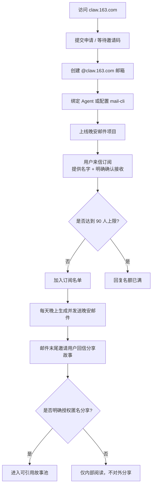

# claw-goodnight-email

[English](./README.en.md)

一个适用于 Codex / OpenClaw 的晚安邮件 Skill。它可以帮助你用 ClawEmail 或任意“邮箱驱动”的方式，运行一个小而稳定、语气有人味的晚安邮件项目。

它主要解决这些事：

- 通过邮箱收集订阅
- 控制固定名额上限
- 处理退订请求
- 收集用户故事投稿与匿名分享授权
- 生成每晚的晚安邮件
- 通过 `mail-cli` 执行 nightly 批量发送

## 这是什么

这个仓库提供的是一套“每天夜里给用户写一封信”的轻量运行模型。

默认工作方式是：

- 用户给你的项目邮箱发信，提供名字并明确表示愿意订阅
- 系统把订阅者写入 `data/state.json`
- 每天晚上为所有有效订阅者生成一封晚安邮件
- 每封邮件都可以自然地邀请用户回信讲述一件小事
- 只有当用户明确说出“可以匿名分享”这类授权语句时，投稿内容才允许被后续邮件引用

整体语气不是 newsletter，也不是客服回复，而是更克制、温和、像真人写出来的信。

## 如何申请 ClawEmail 邮箱

ClawEmail 官网地址：

- [claw.163.com](https://claw.163.com)

目前这个产品通常仍带有内测属性。常见申请路径是：

1. 打开官网并提交申请
2. 等待邀请码或内测资格
3. 创建你的 `@claw.163.com` 邮箱
4. 按官方引导完成 Agent 绑定或 CLI 配置
5. 把 README、`SKILL.md` 里的项目邮箱占位符替换成你自己的地址

如果你是第一次接触这个项目，建议先在官网完成邮箱创建，再回来接这个 Skill。

## 流程图

下面这张图展示了“申请邮箱 → 用户订阅 → 每晚发送 → 故事回流”的完整链路：



Excalidraw 源文件在：

- `assets/claw-goodnight-email-flow.excalidraw`

## 仓库结构

```text
claw-goodnight-email/
├── README.md
├── README.en.md
├── SKILL.md
├── agents/openai.yaml
├── data/state.json
├── references/
├── scripts/goodnight_manager.py
├── scripts/send_nightly_batch.py
└── scripts/run_nightly_sender.sh
```

## 脱敏说明

这个开源版本已经做过脱敏处理：

- 不包含真实订阅邮箱
- 不包含真实用户名
- 不包含真实发送日志
- 不包含机器上的绝对路径
- 不包含任何私有 token 或凭据

如果你在生产环境里使用，建议继续把运行态数据和日志排除在版本控制之外。

## 运行要求

- Python 3.10+
- 真实发信时本机可用 `mail-cli`
- `mail-cli` 对应的邮箱 profile 已经提前配置好

如果只是本地验证流程，可以先用 `--dry-run`，不真正发送。

## 快速开始

在项目根目录执行：

```bash
python3 scripts/goodnight_manager.py --help
```

手动添加一个订阅用户：

```bash
python3 scripts/goodnight_manager.py subscribe \
  --email "reader@example.com" \
  --name "小雨"
```

处理一封来信：

```bash
python3 scripts/goodnight_manager.py receive \
  --email "reader@example.com" \
  --subject "我想加入晚安邮件计划" \
  --body "你好，我叫小雨，我确认愿意接收每天一封晚安邮件。"
```

预览今晚会发送什么，但不真正发出：

```bash
./scripts/run_nightly_sender.sh --dry-run
```

查看当前订阅和故事池概览：

```bash
python3 scripts/goodnight_manager.py summary
```

## 主要命令

`goodnight_manager.py`

- `receive`：处理一封来信，判断是订阅、退订、投稿还是普通交流
- `subscribe`：手动添加订阅用户
- `unsubscribe`：手动退订用户
- `compose-batch`：只生成今晚的邮件内容，不执行发送
- `list-stories`：查看故事投稿及授权状态
- `summary`：查看当前有效订阅人数和故事池概览

`send_nightly_batch.py`

- 通过 `mail-cli` 执行真实 nightly 批量发送
- 写入 JSONL 发送日志
- 只有单封发送成功后才更新 `sent_count` 和 `last_sent_on`

`run_nightly_sender.sh`

- 推荐的稳定发信入口
- 用较干净的 shell 环境调用 `send_nightly_batch.py`

## 运行时文件

仓库里保留的示例文件：

- `data/state.json`：空白初始状态文件

运行时忽略文件：

- `data/send-log.jsonl`：发送日志，运行后自动生成

## 故事投稿如何工作

这个项目不会伪造“用户故事”。

只有来自真实用户回信、并且明确给出匿名授权的内容，才允许被后续邮件引用。比如：

- “可以匿名分享”
- “你可以匿名整理后发出去”

如果没有这类明确授权，内容最多只能内部阅读，不能出现在之后的晚安邮件里。

## 开源后如何自定义

如果你要把这个仓库直接用于自己的项目，建议先替换这些内容：

- 项目邮箱占位符，例如改成 `your-project@claw.163.com`
- `README` 里的项目介绍
- `SKILL.md` 里的业务边界与话术
- `references/` 里的语气、回信模板和故事规则

建议优先阅读：

- `SKILL.md`
- `references/content-style.md`
- `references/story-workflow.md`

## License

MIT
