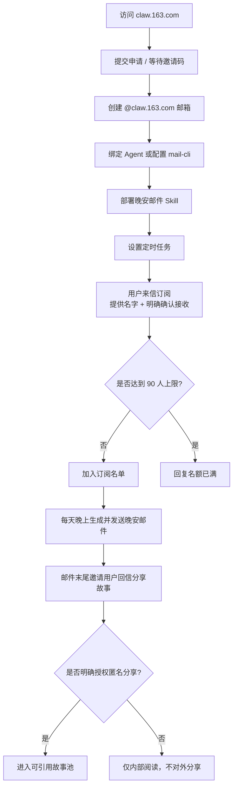

# claw-goodnight-email

[English](./README.en.md)

这是一个晚安邮件 Skill。

它适合用来搭一个小而稳的“夜间陪伴型邮件项目”：用户通过邮箱订阅，你在每天晚上固定时间，给他们发一封真正像人写出来的晚安邮件。它不是资讯 newsletter，也不是自动客服，而更像一种克制、温和、长期陪伴的通信方式。

这个 Skill 主要负责四件事：

- 通过邮箱收集订阅与退订
- 维护固定名额上限
- 生成每晚的晚安邮件
- 收集用户回信里的故事，并在获得明确授权后匿名分享

## 这是一个什么样的 Skill

你可以把它理解成一个“晚安邮件计划”的基础设施。

默认工作方式很简单：

- 你先准备一个 `@claw.163.com` 邮箱
- 用户给这个邮箱发来订阅邮件，留下名字，并明确表示愿意接收
- Skill 维护订阅名单、退订状态和故事投稿状态
- 到了每天晚上的固定时间，系统生成并发送一封晚安邮件
- 邮件末尾会邀请用户回信讲述一件小事
- 只有当用户明确说出“可以匿名分享”这类授权语句时，投稿内容才允许进入后续邮件的故事池

这个项目的重点不是“自动发信”本身，而是把邮件写得像一封真正的信，并把整条订阅、发送、投稿、回信链路处理得自然、可信、有边界。

## 部署流程

如果你想把这个 Skill 真正跑起来，建议按下面四步来：

### 1. 申请 `claw.163.com` 邮箱

ClawEmail 官网地址：

- [claw.163.com](https://claw.163.com)

常见路径是：

1. 打开官网提交申请
2. 等待邀请码或开通资格
3. 创建你的 `@claw.163.com` 邮箱

建议先把这个邮箱申请下来，再继续后面的步骤。

### 2. 连接它和 OpenClaw

邮箱准备好之后，你需要把这个邮箱接入你的 Agent 工作流。

通常这里会做两件事：

1. 按官方方式完成 Agent 绑定，或者配置对应的 CLI 发信能力
2. 确保本机真实发信时可以通过 `mail-cli` 正常调用这个邮箱

这一步的目标不是“先把所有内容都写好”，而是先打通基础收发链路，让这个邮箱真的能被 Skill 调用起来。

### 3. 部署 Skill

把这个仓库放到你的工作目录之后，重点需要确认这些文件：

- `SKILL.md`：定义这个 Skill 的行为边界、语气和处理规则
- `scripts/goodnight_manager.py`：负责订阅、退订、投稿和内容生成
- `scripts/send_nightly_batch.py`：负责 nightly 发信
- `scripts/run_nightly_sender.sh`：推荐的稳定发送入口

你通常至少要做这几件事：

1. 把 README / `SKILL.md` 里的项目邮箱占位符换成你自己的项目邮箱
2. 检查 `references/` 下的语气、回信模板和故事规则，确认符合你自己的项目风格
3. 用 `summary` 和 `--dry-run` 先跑通一次本地验证

### 4. 设置定时

这个 Skill 本身已经包含 nightly sender，但真正的“每天晚上自动执行”仍然需要你在外层做定时调度。

推荐把它设置成每天晚上固定运行一次，比如 `21:00`。

你可以通过自己的调度方式去触发：

- 系统 cron
- OpenClaw cron
- 任何你现有的自动化调度器

核心原则只有一个：

- 真实发信统一走 `./scripts/run_nightly_sender.sh`

这样发送逻辑会更稳定，也更容易排查问题。

## 流程图

下面这张图展示了“申请邮箱 → 用户订阅 → 每晚发送 → 故事回流”的完整链路：



Excalidraw 源文件在：

- `assets/claw-goodnight-email-flow.excalidraw`

## 仓库结构

```text
claw-goodnight-email/
├── README.md
├── README.en.md
├── SKILL.md
├── agents/openai.yaml
├── data/state.json
├── references/
├── scripts/goodnight_manager.py
├── scripts/send_nightly_batch.py
└── scripts/run_nightly_sender.sh
```

## 运行要求

- Python 3.10+
- 真实发信时本机可用 `mail-cli`
- `mail-cli` 对应的邮箱 profile 已经提前配置好

如果只是本地验证流程，可以先用 `--dry-run`，不真正发送。

## 快速开始

在项目根目录执行：

```bash
python3 scripts/goodnight_manager.py --help
```

手动添加一个订阅用户：

```bash
python3 scripts/goodnight_manager.py subscribe \
  --email "reader@example.com" \
  --name "小雨"
```

处理一封来信：

```bash
python3 scripts/goodnight_manager.py receive \
  --email "reader@example.com" \
  --subject "我想加入晚安邮件计划" \
  --body "你好，我叫小雨，我确认愿意接收每天一封晚安邮件。"
```

预览今晚会发送什么，但不真正发出：

```bash
./scripts/run_nightly_sender.sh --dry-run
```

查看当前订阅和故事池概览：

```bash
python3 scripts/goodnight_manager.py summary
```

## 主要命令

`goodnight_manager.py`

- `receive`：处理一封来信，判断是订阅、退订、投稿还是普通交流
- `subscribe`：手动添加订阅用户
- `unsubscribe`：手动退订用户
- `compose-batch`：只生成今晚的邮件内容，不执行发送
- `list-stories`：查看故事投稿及授权状态
- `summary`：查看当前有效订阅人数和故事池概览

`send_nightly_batch.py`

- 通过 `mail-cli` 执行真实 nightly 批量发送
- 写入 JSONL 发送日志
- 只有单封发送成功后才更新 `sent_count` 和 `last_sent_on`

`run_nightly_sender.sh`

- 推荐的稳定发信入口
- 用较干净的 shell 环境调用 `send_nightly_batch.py`

## 故事投稿如何工作

这个项目不会伪造“用户故事”。

只有来自真实用户回信、并且明确给出匿名授权的内容，才允许被后续邮件引用。比如：

- “可以匿名分享”
- “你可以匿名整理后发出去”

如果没有这类明确授权，内容最多只能内部阅读，不能出现在之后的晚安邮件里。

## 开源后如何自定义

如果你要把这个仓库直接用于自己的项目，建议先替换这些内容：

- 项目邮箱占位符，例如改成 `your-project@claw.163.com`
- `README` 里的项目介绍
- `SKILL.md` 里的业务边界与话术
- `references/` 里的语气、回信模板和故事规则

建议优先阅读：

- `SKILL.md`
- `references/content-style.md`
- `references/story-workflow.md`

## License

MIT
